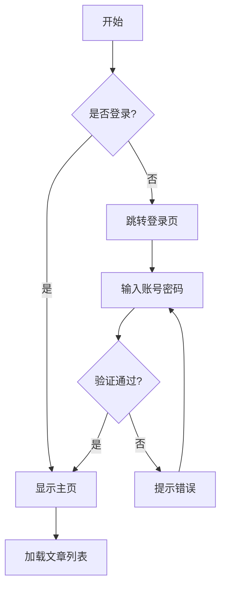
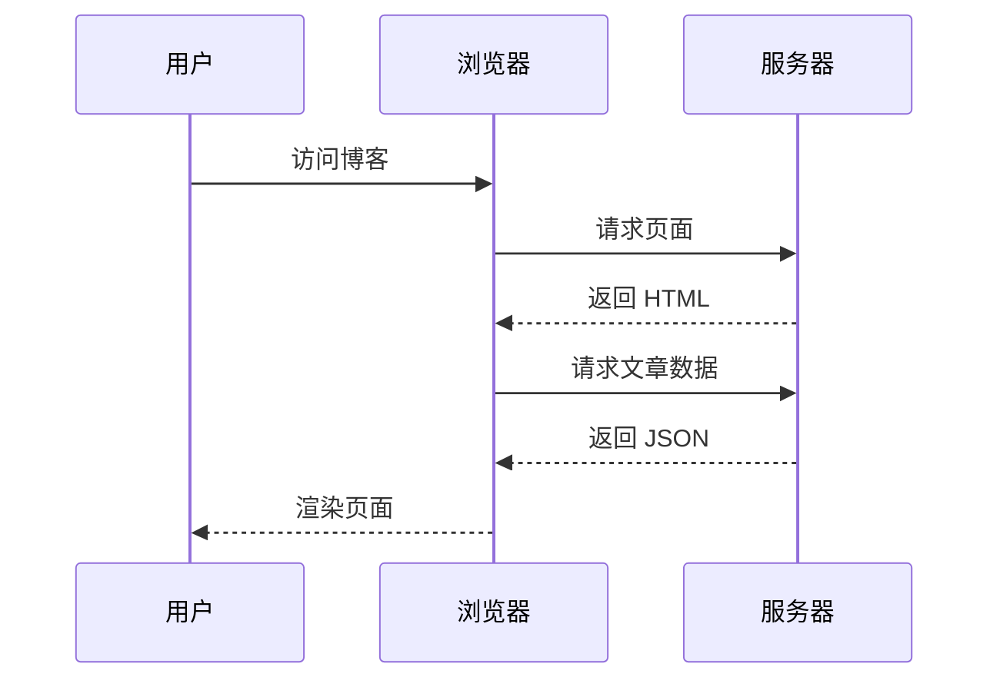

这是一篇测试文章，用来验证博客的各项功能是否正常运作。

## 代码块

### 语法高亮

```typescript
// TypeScript 示例
interface Post {
  title: string;
  published: Date;
  tags: string[];
}

const post: Post = {
  title: "Hello Firefly",
  published: new Date(),
  tags: ["blog", "astro"],
};

console.log(post);
```

```python
# Python 示例
def fibonacci(n: int) -> list[int]:
    a, b = 0, 1
    result = []
    for _ in range(n):
        result.append(a)
        a, b = b, a + b
    return result

print(fibonacci(10))
```

### 代码组 (Tab 切换)

:::code-group

```js [JavaScript]
const greeting = "Hello, World!";
console.log(greeting);
```

```ts [TypeScript]
const greeting: string = "Hello, World!";
console.log(greeting);
```

```rust [Rust]
fn main() {
    let greeting = "Hello, World!";
    println!("{}", greeting);
}
```

:::

## 数学公式 (KaTeX)

行内公式：$E = mc^2$

独立公式块：

$$
\int_{-\infty}^{\infty} e^{-x^2} \, dx = \sqrt{\pi}
$$

矩阵示例：

$$
\begin{pmatrix}
a & b \\
c & d
\end{pmatrix}
\begin{pmatrix}
x \\
y
\end{pmatrix}
=
\begin{pmatrix}
ax + by \\
cx + dy
\end{pmatrix}
$$

化学方程式（mhchem 扩展）：$\ce{2H2 + O2 -> 2H2O}$

## 表格

| 功能 | 状态 | 说明 |
| :--- | :--: | :--- |
| 代码高亮 | ✅ | 支持多种语言 |
| KaTeX 数学 | ✅ | 行内与块级公式 |
| Mermaid 图表 | ✅ | 流程图、时序图等 |
| 文章加密 | ✅ | 密码保护 |
| 评论区 | ✅ | 多种评论系统 |

## Mermaid 流程图



## 时序图



## 提示块 (Callout / Admonition)

> [!NOTE]
> 这是一个普通提示框，用于补充说明信息。

> [!TIP]
> 这是一个技巧提示，分享一些有用的建议。

> [!IMPORTANT]
> 这是一个重要提示，请务必关注此处的内容。

> [!WARNING]
> 这是一个警告提示，提醒用户注意潜在风险。

> [!CAUTION]
> 这是一个危险提示，操作前请仔细阅读以避免严重后果。

## 引用

> 这是一层引用。

> > 这是嵌套引用——引用中的引用。
>
> 回到第一层。

## 列表

### 无序列表

- Firefly 是基于 Astro 7 的静态博客主题
- 支持 Svelte 5 交互组件
- 内置搜索、归档、友链等功能

### 有序列表

1. 安装依赖：`pnpm install`
2. 启动开发：`pnpm dev`
3. 构建部署：`pnpm build`

### 任务列表

- [x] 完成前端开发
- [x] 集成评论系统
- [ ] 添加文章搜索
- [ ] 优化 SEO

## 图片


## 链接

[Firefly 项目地址](https://github.com/XQNH1937/firefly)

自动链接：<https://github.com>

## 删除线

~~这段内容已被删除。~~

## 分割线

---

以上是 Firefly 博客主要功能的测试内容。如果各项均正常显示，说明博客部署无误 🎉
